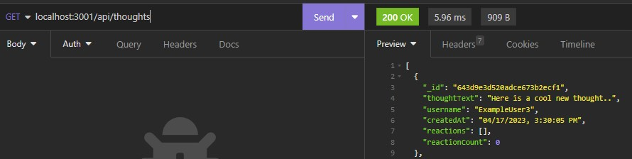

# Social Media API

## Description

this API allows users to create new users and thoughts, delete those users and thoughts, and can show you all of them.

## Installation
run "npm i", then run npm run dev, open the port in Insomnia, and it should be up and running!

